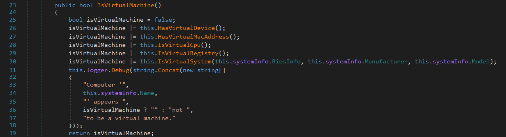
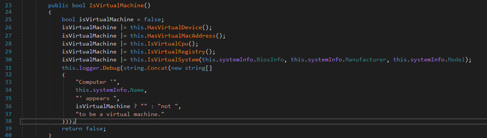
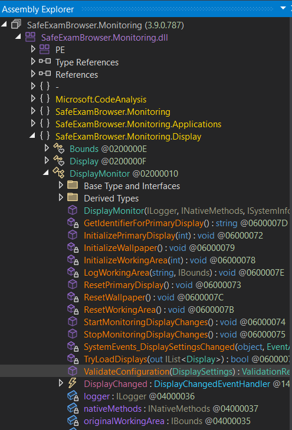
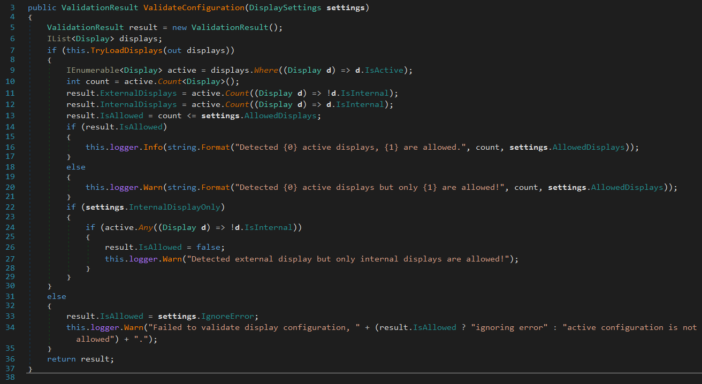
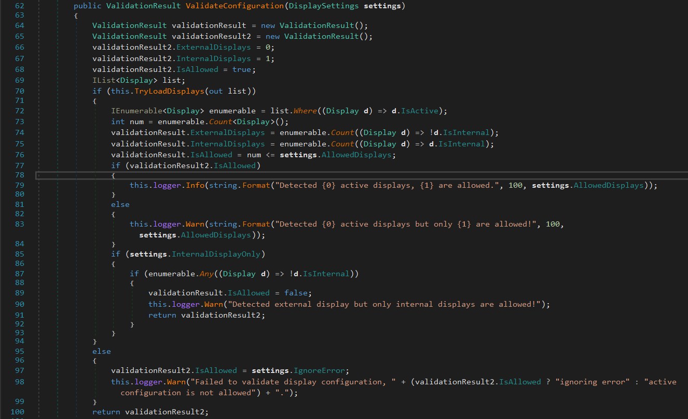
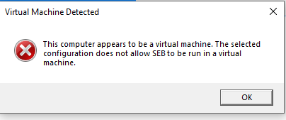
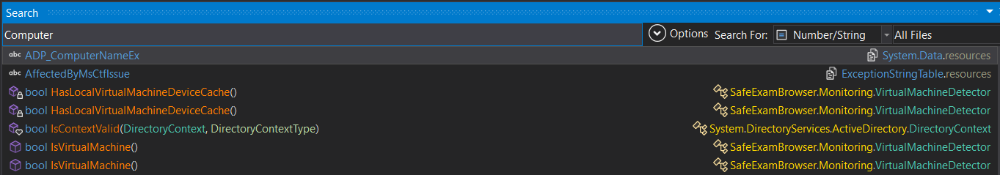
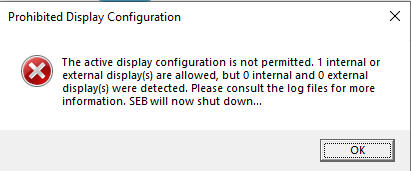

## Requirements
- PC/Laptop yang bisa menjalankan Windows Virtual Machine dan terinstall SEB
- SEB version == 3.9.0.787
- (Optional) [dnSpyEx](https://github.com/dnSpyEx/dnSpy/releases)

## Quick bypass . . .
1. [Download](https://github.com/seynth/onslaught-seb/releases/tag/v0.0.1)
2. Place it inside `..\Program Files\SafeExamBrowser\Application\`
3. Run SEB 

## Step by step bypass VM detector SEB
1. Download `dnSpyEx` untuk decompile file dll C# dan mengeditnya
2. Run dnSpyEx as administrator, kemudian `File->Open` atau bisa menggunakan shortcut `Ctrl+O` untuk memilih dll file yang ingin kita edit dan buka folder tempat kamu menyimpan SEB, defaultnya sih di `C:\Program Files\SafeExamBrowser\Application` kemudian pilih file `SafeExamBrowser.Monitoring.dll`  
3. (Optional) kalian boleh menjelajahi filenya dan mencari tahu apa yang SEB lakukan dibalik layar dan coba mengganti apapun yang kalian inginkan. Tidak hanya `SafeExamBrowser.Monitoring.dll` kalian boleh mengganti dengan file dll apapun selama file itu dibuat dengan C#
4. Selanjutnya kita akan mengganti 2 fungsi yang ada pada `SafeExamBrowser.Monitoring.dll` yaitu `SafeExamBrowser.Monitoring.Display.ValidateConfiguration` dan `SafeExamBrowser.Monitoring.IsVirtualMachine` 
5. Bypass `SafeExamBrowser.Monitoring.IsVirtualMachine`
	

		berikut adalah fungsi asli dari `IsVirtualMachine` dari namanya sudah terlihat fungsi ini ngapain aja. Untuk bypassnya cukup mudah sebenarnya kita hanya perlu mengganti return valuenya menjadi false. Langkah pertama kita klik kanan didalam fungsinya lalu klik `Edit Method (C#)` kemudian ganti return valuenya menjadi false dan compile. Fungsi ini akan terlihat seperti dibawah jika sudah kalian edit
		 
6. Bypass `ValidateConfiguration` 
	Pertama tama silahakan kalian pergi ke assembly editor dan cari fugsinya
	
	kemudian kita edit fungsinya, langkahnya seperti edit method sebelumnya, tapi kali ini kita perlu membuat object ValidationResult untuk kemudian mereturnnya.
	
	fungsi ini mengatur display yang diperbolehkan selama menggunakan SEB dengan membuat object ValidationResult pada baris ke 5 kemudian pada baris ke 11, dan 12  mengisi property object tsb dengan jumlah display yang diperbolehkan. Jika kita hover mouse kita pada `result.ExternalDisplays` kita akan melihat property ini bertipekan int sedangkan asumsi saya property ini mengatur berapa monitor tambahan yang boleh tersambung dengan PC/Laptop yang sedang menjalankan SEB
	
	"Apakah menyambungkan monitor ke laptop dan mengeset property ini menjadi 2 akan terjadi dual monitor? Ooops . . . .".  
	
	Property `result.IsAllowed` dengan tipe boolean digunakan untuk membandingkan display yang ada saat ini dan konfigurasi yang disetel oleh si pembuat tes yang menentukan berapa maksimal display yang dapat dipakai. 

	Untuk membypass fungsi ini pertama kita perlu membuat object dengan class
	ValidationResult dan mengisi propertynya dengan value yang kita inginkan dan mereturn object yang barusan kita buat sebagai return valuenya. berikut fungsi ValidateConfiguration setelah diedit
	
	pada fungsi yang telah diedit kita membuat object baru bernama validationResult2 dengan property yang kita inginkan, mengganti beberapa dan mereturnnya.

	
 	Done!!, selanjutnya adalah menyimpan semua perubahan dengan cara `File->Save All`  dan klik ok. Enjoyyy . . .

## How I found this vulnerability 
#ILCodeReversibility #CodeDecompilationVulnerability

Pertama saya menemukan cara untuk membypass karena rasa penasaran dan nama software itu sendiri 'Safe' yang mendorong saya "se-safe apa sih softwarenya?" 🗿

Saya menemukan bahwa software ini dibuat dengan C# dan kelemahan bahasa ini adalah mengcompile codenya menjadi IL alih alih langsung ke machine code.Ketika software ini di run, IL ini kemudian dicompile JIT (Just In Time) ke machine code yang spesifik untuk platform yang kita gunakan. IL ini bisa kita kembalikan ke kode aslinya karena masih menyimpan metadata seperti nama fungsi, class, dan properti. 

Saya sebelumnya pernah mengalami tentang bagaimana melihat dan bahkan mengedit C# code ini. Dengan waktu yang lama saya menelusuri apa sih yang software ini lakukan dibalik layar dan bagaimana cara menembusnya?, saya berpikir bagaimana jika membuat ImGui overlay, cara kerjanya sama seperti mod menu pada cheat games kita menekan tombol kombinasi pada keyboard dan menu overlay pun muncul, tapi kemudian saya menemukan bahwa software ini menggunakan kiosk mode yang mengunci sistem kita dan tidak memperbolehkan shortcut seperti Win+Tab atau Alt+Tab (tergantung konfigurasi yang diberikan pengawas).

Tapi saya tidak berhenti sampai disitu, saya kemudian mencoba menjalankan software ini dengan windows virtual machine. Saat saya jalankan ada error yang sangat menarik muncul . . .

Woww sssserruuu sekaliiiii................

Seketika ada banyak pertanyaan yang muncul di benak saya seperti "bagaimana cara tracing errornya?", "gimana cara tau dimana error ini didefinisikan?", "ini error buatan si developernya atau murni error dari windowsnya?", satu satunya petunjuk saya adalah string errornya yang kemudian saya mulai mencari string yang ada pada error itu di dnSpyEx tapi hasilnya nihil. Setelah penelusuran lebih lanjut ternyata SEB ini ternyata ada log filenya yang mencatat apa saja yang software ini lakukan,,,, seketika saya tertarik untuk membaca lognya yang berada di `..\AppData\Local\SafeExamBrowser\Logs\XXXX_Runtime.log`.

Setelah membaca lognya saya menemukan bahwa log ini akan berhenti jika SEB mengalami error atau ada konfigurasi yang dilanggar seperti run SEB di Virtual Machine 😋. Error ini berbunyi kurang lebih seperti . . .

`- DEBUG: [VirtualMachineDetector] Computer 'DESKTOP-QWERTY' appears to be a virtual machine.`

BINGO!! saya kemudian bisa mencari string tersebut di dalam dnSpyEx dengan keyword `Computer` 

dan seharusnya kalian sudah tau fungsi IsVirtualMachine ngapain dengan melihat return typenya dan nama fungsinya ggzz!!

> [!IMPORTANT]
> Kalian bisa search string seperti yang saya lakukan diatas karena SEB ini menulis secara langsung errornya seperti `Computer ..... appears to be a virtual machine.` ke dalam log filenya lewat file dll yang sedang saya analisis 

Dan begitulah saya menemukan fungsi IsVirtualMachine yang menghambat SEB tidak bisa dijalankan di VM

Kelarr masalah . . .
. . .
*loh . . .* 

Tapi saat saya jalankan muncul masalah baru 😔

Tapi tenang kita sudah tahu cara mengatasinya dengan cara `baca lognya->cari string errornya->dan bingo ketemu functionnya` . Kali ini errornya berbeda dengan yang diatas kurang lebih seperti 

`- WARNING: [DisplayMonitor] Failed to validate display configuration, active configuration is not allowed.`

We can easily type `Failed to validate` di dnSpy dan saat itu juga kita bertemu dengan fungsi `ValidateConfiguration` kemudian tinggal kita modifikasi seperti step diatas.

# Summary

Bahkan software yang memberi nama dirinya "Safe" pada akhirnya akan ditembus karena salah atau kurang mengamankan teknologi yang digunakannya. Pada project kali ini menurut saya perpaduan C# dan log file menjadi celah. C# yang mudah dibaca (tanpa Obfuscation) yang mengarahkan kita pada log filenya yang mudah diakses yang kemudian mengarah ke critical function. dnSpyEx menjadi MC pada bypass saya kali ini. Code Obfuscation perlu diterapkan pada software ini atau metode metode lain seperti Anti Tamper yang melindungi file XYZ.dll. Solusi terakhir adalah mengganti bahasa yang digunakan yang memastikan mengcompile code kita langsung menjadi machine code

Project ini hanya log untuk mengasah Reverse Engineering skill pada real world scenario (dalam kasus ini SEB). Terimakasih . . . 

## *Is this secure?, even "Safe" is part of it's name?*

``

